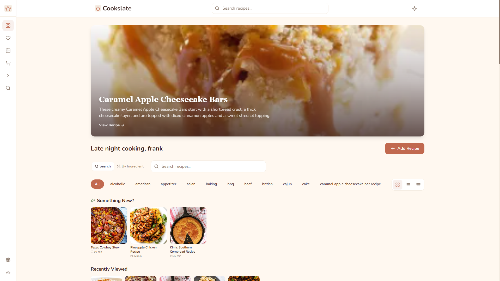
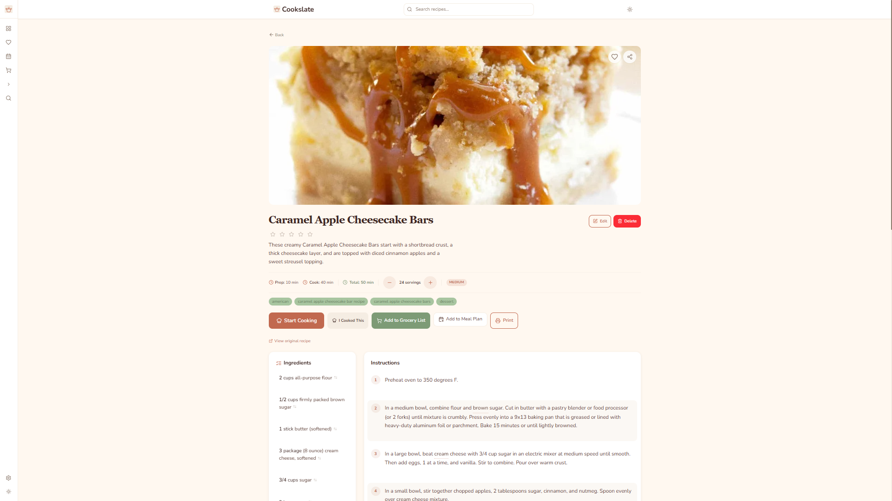
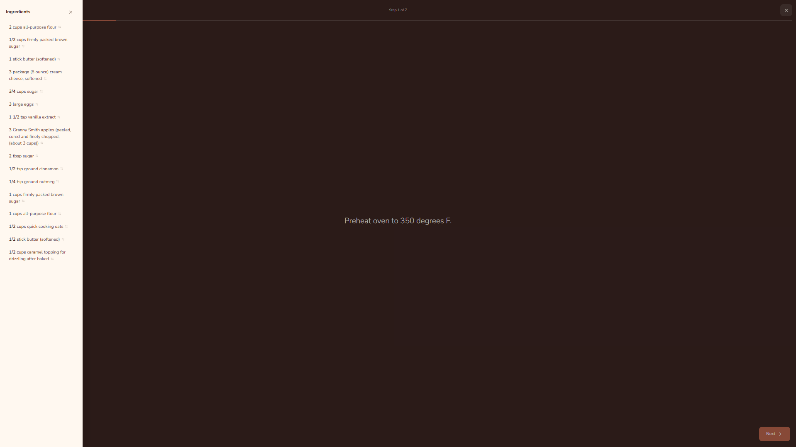
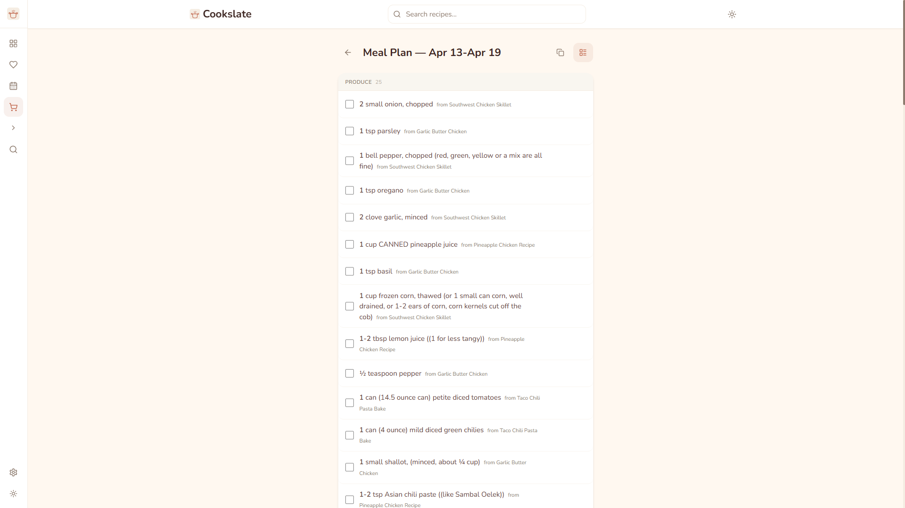
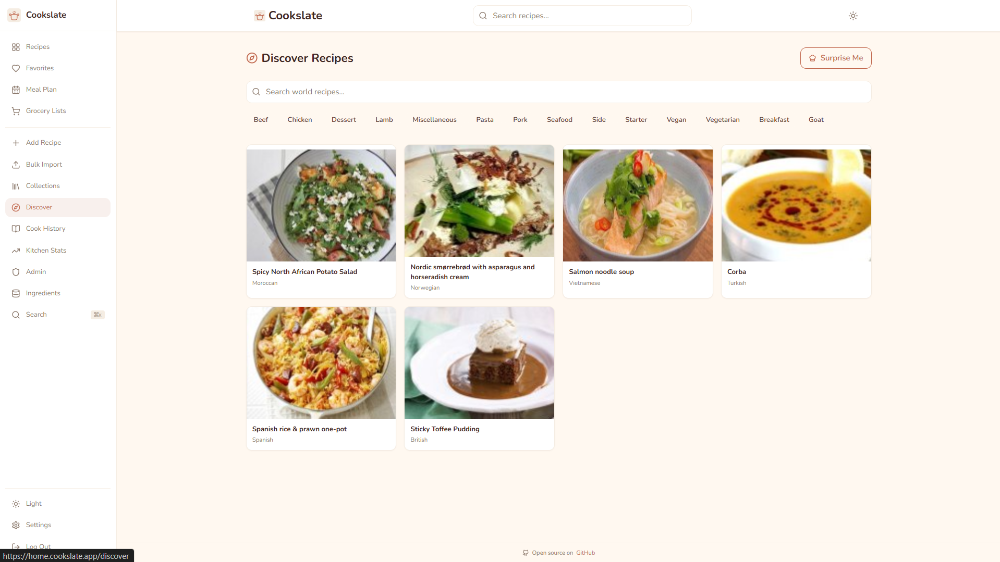
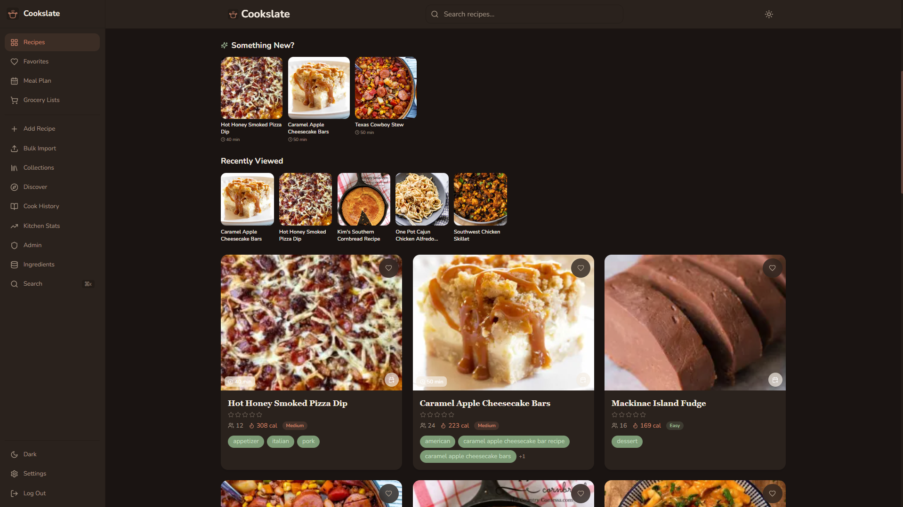

<!-- auto-docs:start:header -->
# Cookslate

> A recipe manager that remembers how you cook — not just what you cook

| Field | Value |
|-------|-------|
| Status | beta |
| Phase | grow |
| Target launch | 2026-07-01 |
| Stack | PHP 8.1, React 18, Vite, Tailwind CSS 4, MySQL 8 |
<!-- auto-docs:end:header -->

<!-- auto-docs:preserved:start -->
**Live demo:** [demo.cookslate.app](https://demo.cookslate.app) (login: demo / demo -- fully interactive, resets hourly)

**No Docker required.** Runs on any PHP 8.1+ hosting with MySQL. Docker Compose included if you prefer it.

### Features

**Core (free, MIT licensed):**
- Import recipes from any URL -- paste a link, structured data is scraped automatically
- Cook Mode -- step-by-step instructions with built-in timers, screen wake lock, and vibration alerts
- Grocery lists with smart consolidation (combines "1 cup milk" + "2 cups milk" automatically)
- Full-text search across titles, descriptions, and ingredients
- Bulk import from Mealie, Paprika, and Tandoor
- JSON-LD and Cooklang export for data portability
- Authentik SSO support (zero-library, header-based)
- Mobile-first responsive design with 44px+ tap targets

**Pro tier ($29.99 one-time, BSL licensed):**
- Meal planning with drag-and-drop weekly calendar and iCal export
- Shoppable grocery quantities (converts "2 cups milk" to "Milk - 1 gallon")
- Pantry tracking -- mark always-stocked items, auto-detected on grocery lists
- Recipe annotations (margin notes on ingredients and steps)
- Ingredient database with USDA nutrition data, package sizes, and substitutions
- Household tier ($49.99) supports up to 5 users
<!-- auto-docs:preserved:end -->

<!-- auto-docs:start:description -->
## What is this?

Self-hosted recipe management app with Cook Mode, grocery lists, and pantry tracking

**Target users:** Home cooks, privacy-conscious families, self-hosting enthusiasts
<!-- auto-docs:end:description -->

<!-- auto-docs:start:pricing -->
## Pricing

| Tier | Price | What you get |
|------|-------|-------------|
| Free | $0 | Full recipe management, import, search, Cook Mode, grocery lists |
| Pro | $29.99 one-time | Meal planning, shoppable quantities, pantry, annotations, nutrition |
| Household | $49.99 one-time | Everything in Pro for up to 5 users |

Open-core model: free tier is MIT licensed, Pro/Household features are BSL 1.1 (converts to MIT in 2029).
<!-- auto-docs:end:pricing -->

<!-- auto-docs:start:docs -->
## Documentation

- [Setup Guide](docs/SETUP.md) -- getting the dev environment running
- [Architecture](docs/ARCHITECTURE.md) -- stack, components, and decisions
- [Changelog](docs/CHANGELOG.md) -- release history
<!-- auto-docs:end:docs -->

<!-- auto-docs:start:screenshots -->
## Screenshots

*Recipe dashboard with featured recipe, tag filters, and recent activity*

*Recipe detail view with ingredients, instructions, and Cook Mode launcher*

*Cook Mode -- step-by-step instructions with ingredient sidebar*

*Grocery list generated from meal plan with source recipe tracking*

*Discover page for browsing world recipes by category*

*Full dark mode support*

<!-- auto-docs:end:screenshots -->

<!-- auto-docs:start:contact -->
## Contact

https://github.com/frobinson47/cookslate/issues
<!-- auto-docs:end:contact -->

---

_Generated by `auto-docs` -- Re-render with `python scripts/docs_tool.py generate cookslate`_
